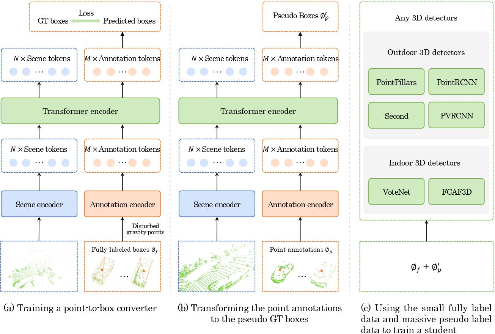
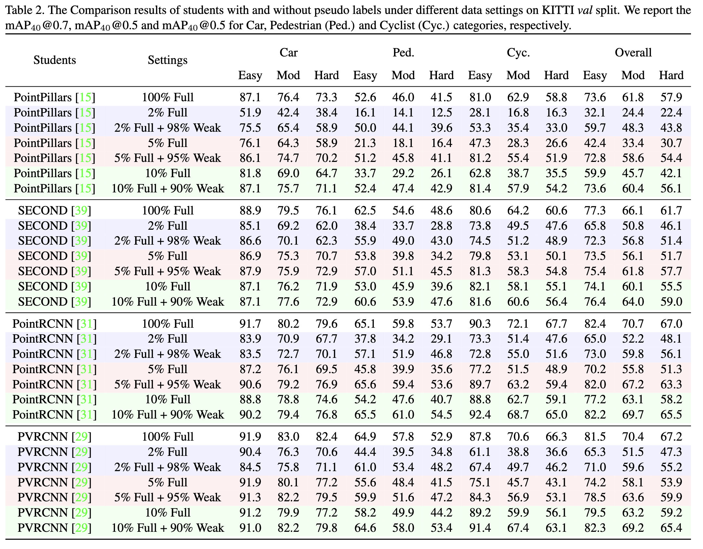
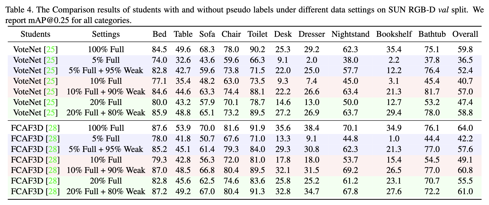

<div>

</div>

# ViT-WSS3D: A Simple Vision Transformer for Weakly Semi-supervised 3D Object Detection [[ICCV 2023 Paper](https://www.computer.org/csdl/proceedings-article/iccv/2023/071800i339/1TJjXBtFOp2)]

## Introduction
This is the official repository for the ICCV 2023 paper: A Simple Vision Transformer for Weakly Semi-supervised 3D Object Detection 

## Pipeline
<div align="center">

</div>

## Installation
Please follow the instructions of MMDetection3D installation (https://github.com/open-mmlab/mmdetection3d/blob/v1.0.0rc4/docs/en/getting_started.md)

## Data Preparation
We use KITTI and SUN RGB-D dataset in this project, please follow the following instructions to prepare the dataset.

### KITTI
1. Following the `Prepare Dataset` section in https://github.com/open-mmlab/mmdetection3d/blob/v1.0.0rc4/docs/en/datasets/kitti_det.md#prepare-dataset
2. Download the data split file:
```shell
mkdir ./data/kitti/ && mkdir ./data/kitti/ImageSets

# Download data split
wget -c  https://raw.githubusercontent.com/traveller59/second.pytorch/master/second/data/ImageSets/test.txt --no-check-certificate --content-disposition -O ./data/kitti/ImageSets/test.txt
wget -c  https://raw.githubusercontent.com/traveller59/second.pytorch/master/second/data/ImageSets/train.txt --no-check-certificate --content-disposition -O ./data/kitti/ImageSets/train.txt
wget -c  https://raw.githubusercontent.com/traveller59/second.pytorch/master/second/data/ImageSets/val.txt --no-check-certificate --content-disposition -O ./data/kitti/ImageSets/val.txt
wget -c  https://raw.githubusercontent.com/traveller59/second.pytorch/master/second/data/ImageSets/trainval.txt --no-check-certificate --content-disposition -O ./data/kitti/ImageSets/trainval.txt
```
3. Create dataset infos:
- For fully-supervised training:
```shell
python tools/create_data.py kitti --root-path ./data/kitti --out-dir ./data/kitti --extra-tag kitti
```
- For weakly semi-supervised training: 
    - For training the point-to-box converter in stage 1, we need to sample a small amount of fully-annotated data. We need the following process because the GT database for GT sampling augmentation needs reprocess to prevent possible data leaking.
    - For generating the pseudo labels in stage 2, we need to sample the remaining data.
```shell
# for 2% full + 98% weak
python tools/create_data_partial_kitti.py --label_ratio 50 
python tools/create_data_partial_kitti.py --label_ratio 50 --generate_label_data
# for 5% full + 95% weak
python tools/create_data_partial_kitti.py --label_ratio 20 --generate_label_data
python tools/create_data_partial_kitti.py --label_ratio 20 
# for 10% full + 90% weak
python tools/create_data_partial_kitti.py --label_ratio 10 --generate_label_data
python tools/create_data_partial_kitti.py --label_ratio 10 
```

The folder structure after processing should be as below
```shell
kitti/
├── ImageSets
├── kitti_dbinfos_train_1_10.pkl
├── kitti_dbinfos_train_1_20.pkl
├── kitti_dbinfos_train_1_50.pkl
├── kitti_dbinfos_train_19_20.pkl
├── kitti_dbinfos_train_49_50.pkl
├── kitti_dbinfos_train_9_10.pkl
├── kitti_dbinfos_train.pkl
├── kitti_gt_database
├── kitti_infos_test_mono3d.coco.json
├── kitti_infos_test.pkl
├── kitti_infos_train_1_10_mono3d.coco.json
├── kitti_infos_train_1_10.pkl
├── kitti_infos_train_1_20_mono3d.coco.json
├── kitti_infos_train_1_20.pkl
├── kitti_infos_train_1_50_mono3d.coco.json
├── kitti_infos_train_1_50.pkl
├── kitti_infos_train_19_20_mono3d.coco.json
├── kitti_infos_train_19_20.pkl
├── kitti_infos_train_49_50_mono3d.coco.json
├── kitti_infos_train_49_50.pkl
├── kitti_infos_train_9_10_mono3d.coco.json
├── kitti_infos_train_9_10.pkl
├── kitti_infos_train_mono3d.coco.json
├── kitti_infos_train.pkl
├── kitti_infos_trainval_mono3d.coco.json
├── kitti_infos_trainval.pkl
├── kitti_infos_val_mono3d.coco.json
├── kitti_infos_val.pkl
├── testing 
└── training
```

### SUN RGB-D
Following the instructions in https://github.com/open-mmlab/mmdetection3d/blob/v1.0.0rc4/docs/en/datasets/sunrgbd_det.md

## Training
### Prepare Pretrained Weights
We use MAE-pretrained weights in this project, please go to https://github.com/facebookresearch/mae/blob/main/FINETUNE.md, then download the ViT-Base and ViT-Large weights, and put them in the root folder of this project (i.e., the same folder of this README).

### KITTI
- Stage 1: training the point-to-box converter
```shell
./tools/dist_train.sh configs/vitwss3d/vitwss3d_base_kitti_10p.py 4 0,1,2,3 --work-dir <to_your_work_path>
```

- Stage 2: inference to get the pseudo GT boxes
```shell
./tools/dist_test.sh configs/vitwss3d/vitwss3d_base_kitti_10p.py <stage_1_trained_pth> 2 \
--out results/kitti-3class/results_eval.pkl --format-only --eval-options 'pklfile_prefix=results/kitti-3class/kitti_results_10' 'submission_prefix=results/kitti-3class/kitti_results_10'
```

- Prepare the training data for Stage 3
    - Change the `label_ratio`, `save_path` and `pseudo_root` according to your settings in `prepare_pseudo_label/conver_pred_to_pseudo.py` and run it:
    ```shell
    cd prepare_pseudo_label
    python conver_pred_to_pseudo.py  # merge pseudo labels and real labels
    ```
    - Create data infos for stage 3 training:
    ```shell
    python tools/create_data_partial_kitti.py --label_ratio 10 --generate_full_pseudo_label_data # generate the pkl
    ```

- Stage 3: train any detector, following instruction takes PointRCNN as example:
```shell
./tools/dist_train.sh ./configs/point_rcnn/point_rcnn_2x8_kitti-3d-3classes_pseudo.py 4 0,1,2,3 --work-dir <to_your_work_path>
```

### SUN RGB-D
- Stage 1: training the point-to-box converter
```shell
./tools/dist_train.sh configs/vitwss3d/vitwss3d_small_sunrgbd_20p.py 4 0,1,2,3 --work-dir <to_your_work_path>
```

- Stage 2: inference to get the pseudo GT boxes
```shell
./tools/dist_test.sh configs/vitwss3d/vitwss3d_small_sunrgbd_20p.py <stage_1_trained_pth> 4 \
--out sunrgbd_20p_results/ --format-only --eval-options 'pklfile_prefix=sunrgbd_20p_results/' 'submission_prefix=sunrgbd_20p_results/'
```

- Stage 3: 
    - Prepare raw data in a new folder:
    ```shell
    cd data
    mkdir sunrgbd_80pseudo
    ln -s <path_to_sunrgbd>/points ./  # soft link the point cloud data
    
    mkdir sunrgbd_trainval/ && cd sunrgbd_trainval/
    # soft link raw data
    ln -s <path_to_sunrgbd>/sunrgbd_trainval/calib ./ 
    ln -s <path_to_sunrgbd>/sunrgbd_trainval/depth ./
    ln -s <path_to_sunrgbd>/sunrgbd_trainval/image ./
    ln -s <path_to_sunrgbd>/sunrgbd_trainval/seg_label ./
    ln -s <path_to_sunrgbd>/sunrgbd_trainval/train_data_idx.txt ./
    ln -s <path_to_sunrgbd>/sunrgbd_trainval/val_data_idx.txt ./

    # soft link the pseudo labels
    ln -s ../../../sunrgbd_20p_results/txt/ ./label 
    ```
    - Run:
    ```shell
    python prepare_pseudo_label/convert_indoor_pred_to_pseudo.py --load_gt_interval 5 --gt_data_root data/sunrgbd --pseudo_txt_root data/sunrgbd_80pseudo/sunrgbd_trainval/label   # merge pseudo labels and real labels
    ```
    - Prepare data infos for stage 3 training:
    ```shell
    python tools/create_data.py sunrgbd --root-path ./data/sunrgbd_80pseudo --out-dir ./data/sunrgbd_80pseudo --extra-tag sunrgbd
    ```

- Stage 3: train any detector, following instruction takes VoteNet as example:
```shell
./tools/dist_train.sh configs/votenet/votenet_16x8_sunrgbd_80pseudo-3d-10class.py 4 0,1,2,3 --work-dir <to_your_work_path>
```

## Results
### KITTI
<div align="center">

</div>

### SUN RGB-D
<div align="center">

</div>

## Citation
```
@inproceedings{zhang2023simple,
  title={A simple vision transformer for weakly semi-supervised 3d object detection},
  author={Zhang, Dingyuan and Liang, Dingkang and Zou, Zhikang and Li, Jingyu and Ye, Xiaoqing and Liu, Zhe and Tan, Xiao and Bai, Xiang},
  booktitle={Proceedings of the IEEE/CVF International Conference on Computer Vision},
  pages={8373--8383},
  year={2023}
}
```